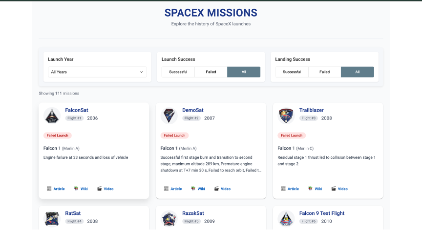
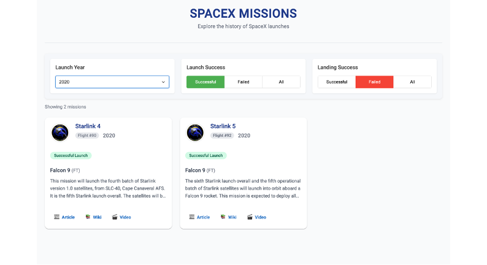
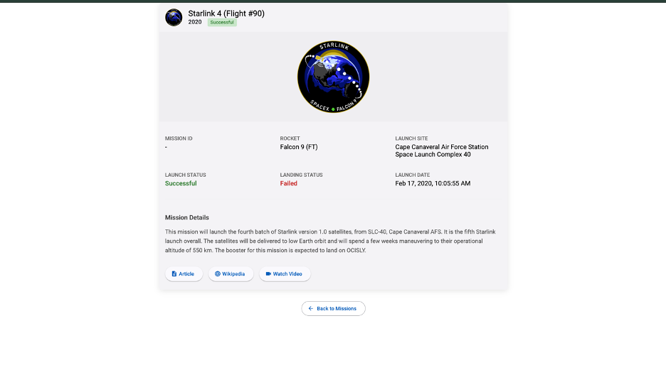

# 🚀 Space Explorer – SpaceX Launch Mission Viewer

# Images
# Home Page(landing Page)
 

# Using Filter
 

# When click on any card (more detailed info)
 

An **Angular Standalone Web App** to browse and filter **SpaceX Launch Missions** using SpaceX Public REST API.  
Developed by **Milan Patel (101397631)** as part of **COMP 3133 Lab Test 2**.  
Fully deployed on **Vercel** from a single repository.

---

## 🌐 Live Demo

🚀 **Production URL:**  
🔗 [https://101397631-labtest-2-comp3133.vercel.app/](https://101397631-labtest-2-comp3133.vercel.app/)  
✅ Frontend hosted live on **Vercel** (Static build)

---

## 🎯 Key Features

- ✅ View list of SpaceX Missions
- ✅ Filter Missions by:
  - **Launch Year**
  - **Successful Launch**
  - **Successful Landing**
- ✅ Detailed view of mission information
- ✅ Clean & Responsive UI (Angular Material)
- ✅ Deployed on **Vercel** using CLI
- ✅ Fully Standalone Angular Components

---

## 🤝 Setup & Installation

### 1️⃣ Clone the Repository
`git clone https://github.com/Milan-p23/101397631_labtest-2_comp3133.git`  
`cd 101397631_labtest-2_comp3133`

### 2️⃣ Install Dependencies
`npm install`

### 3️⃣ Run Locally (Development)
`ng serve`  
Then open your browser at: `http://localhost:4200`

---

## ⚙️ Project Structure

📂 101397631_labtest-2_comp3133  
├── 📂 src  
│   ├── 📂 app  
│   │   ├── 📂 components  
│   │   ├── 📂 services  
│   │   ├── 📂 pages  
│   │   └── app.config.ts  
│   └── 📂 assets  
├── angular.json  
├── package.json  
├── tsconfig.json  
└── README.md  

---

## 🚀 Vercel Deployment Configuration

Project is deployed on **Vercel** using **Vercel CLI**  

**Deployment Commands**
`npx vercel`  
`npx vercel --prod`

---

## 🔥 API Information

SpaceX REST API Endpoint:  
🔗 https://api.spacexdata.com/v3/launches

API Usage in Project:
- **GET /launches** → Fetch all missions

Query Parameters:
- `launch_year` → Filter by year
- `launch_success` → Filter by successful launch
- `land_success` → Filter by successful landing

---

## 💡 Angular Frontend Highlights

- ✅ Standalone Components & Modular Structure
- ✅ Angular Material UI Integration
- ✅ API Integration using Angular Services (HttpClient)
- ✅ Mission Filter Options:
  - Year
  - Launch Success
  - Landing Success
- ✅ Responsive Layout
- ✅ Routing & Navigation
- ✅ Deployed on **Vercel** with Production Build
- ✅ Optimized Performance & Best Practices

---

## 📄 License

This project is licensed under the **MIT License**.

---

## 🙌 Contributing

Feel free to fork, improve and submit pull requests.
